# 🩺 Doctor-Patient Portal System

[](https://react.dev/)
[](https://nodejs.org/)
[](https://www.mongodb.com/)
[](https://tailwindcss.com/)
[](LICENSE)

**A full-stack web application for managing doctor-patient interactions, appointment scheduling, medical records, and organ donation registration/search.**

Patients can book appointments, view their medical history, and register/search for organ donation.  
Doctors can manage slots, view patient history (even before visits), add consultation notes, and access organ donor data.

> **Important**: This is a personal/academic project. **Not for real medical use**. Handles sensitive data only in development/testing environments.

## Problem Statement

We here propose a doctor patient handling, managing system that helps doctors in their work and also patients to book doctor appointments and view medical progress. The system allows doctors to manage their booking slots online. Patients are allowed to book empty slots online and those slots are reserved in their name. The system manages the appointment data for multiple doctors for various date and times. Each time a user visits a doctor his/her medical entry is stored in the database by doctor. Next time a user logs in he may view his/her entire medical history as and when needed. At the same time a doctor may view patients medical history even bore the patient visits him. This allows for an automated patient doctor handling system through an online interface. Our system also consists of organ donor module. This module allows for organ donation registration as well as organ search. The module is designed to help urgent organ requirements through easy/instant searches.


## ✨ Features

- 👤 **Two main roles**: Patient & Doctor (with role-based access control)
- 🗓️ **Appointment booking** — patients see available slots, book instantly
- 📅 **Doctor slot management** — doctors set availability for dates & times
- 📋 **Medical history** — secure storage of consultation notes & prescriptions
- 👁️ **Pre-visit history access** — doctors can review patient records before appointments
- 🫀 **Organ Donor Module** — registration as donor + urgent organ search (type, blood group, urgency filters)
- 🔐 **Authentication & Authorization** — login/signup, protected routes
- 📱 **Responsive design** — works on mobile, tablet, desktop
- ⚡ **Real-time feedback** — loading states, success/error messages
- 🛡️ **Environment variables** — secure handling of secrets (DB URI, JWT secret, etc.)

## 🛠️ Tech Stack

| Layer          | Technology                  |
|----------------|-----------------------------|
| Frontend       | React.js                    |
| Backend        | Node.js + Express           |
| Database       | MongoDB                     |
| Authentication | JWT / bcrypt                |
| Styling        | Tailwind CSS                |
| State Management | React Context / Redux (optional) |
| API Client     | Axios                       |
| License        | MIT                         |

**Project Presentation**: [Doctor-Patient Portal Presentation (PDF)](Doctor-Patient%20Portal.pptx.pdf)

## 🚀 Quick Start (Local Development)

### 1. Clone the repository

```bash
git clone https://github.com/yourusername/doctor-patient-portal.git
cd doctor-patient-portal
```
### 2. Backend Setup (Spring Boot)
```Bash
# Install dependencies
mvn clean install
```
## Create or update src/main/resources/application.properties:
```properties
spring.datasource.url=jdbc:mysql://localhost:3306/doctor_patient_db?useSSL=false&serverTimezone=UTC&allowPublicKeyRetrieval=true

spring.datasource.username=root
spring.datasource.password=yourpassword
spring.jpa.hibernate.ddl-auto=update
spring.jpa.show-sql=true
# JWT
jwt.secret=your_very_long_random_secret_key_2025
jwt.expiration=86400000   # 24 hours in ms

server.port=8080
```

```Bash
# Run the application
mvn spring-boot:run
# or
java -jar target/*.jar
```
### API available at: http://localhost:8080/api/...
### 3. Frontend Setup (React):
Assuming you have a separate frontend/ folder (or repo):
```Bash
cd ../frontend           # adjust path if needed
npm install
Create .env in frontend root:
envVITE_API_URL=http://localhost:8080/api
# or (if using Create React App)
# REACT_APP_API_URL=http://localhost:8080/api
```
```Bash
npm run dev
# or
npm start
```
### Frontend usually opens at http://localhost:5173 (Vite) or http://localhost:3000 (CRA)

### 3. Frontend Setup
```Bash
cd ../frontend          # or your frontend folder
npm install
```
### 📸 Diagarams
#### Use Case Diagarm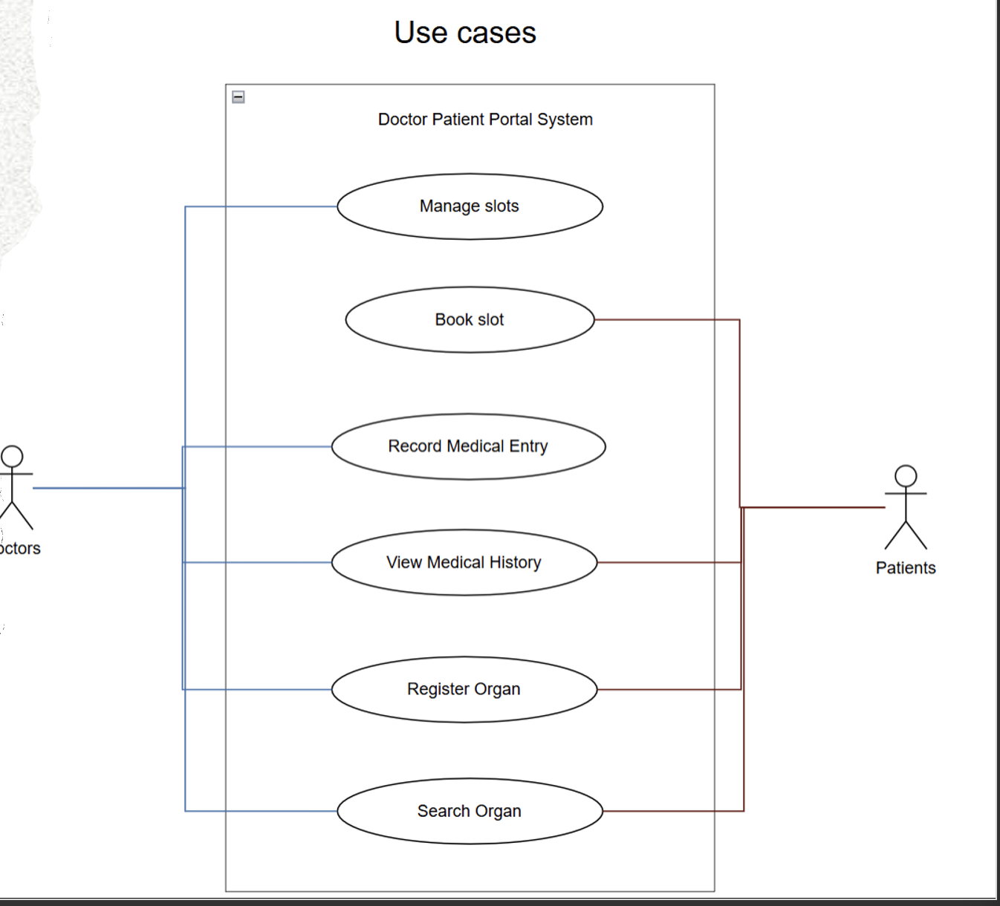

### DFD diagram
#### First refinement of DFD diagram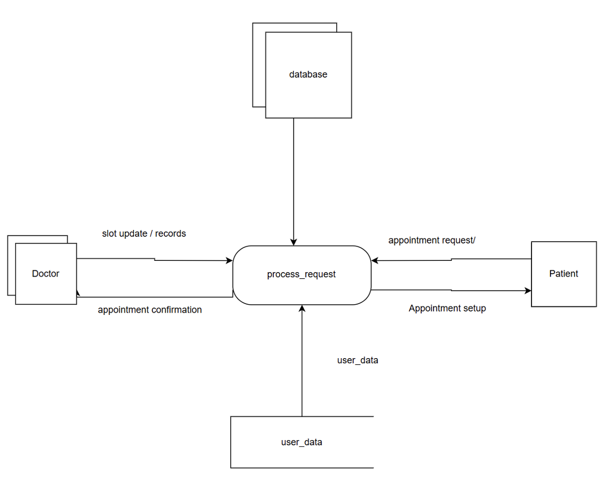
#### Second refinement of DFD diagram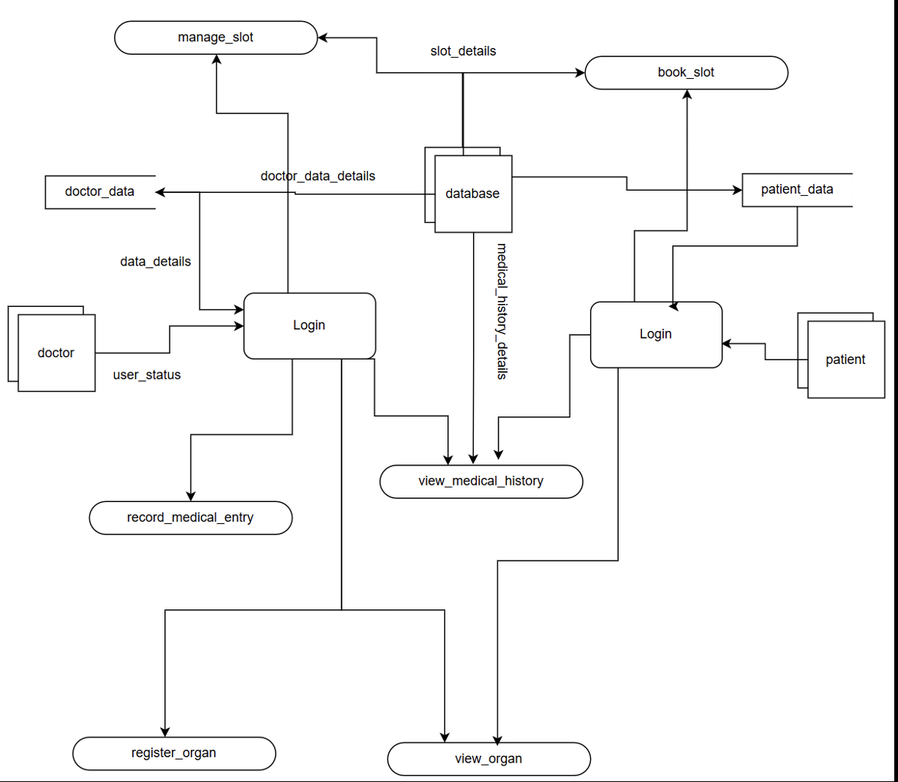
#### FIinal (Working) refinement of DFD diagram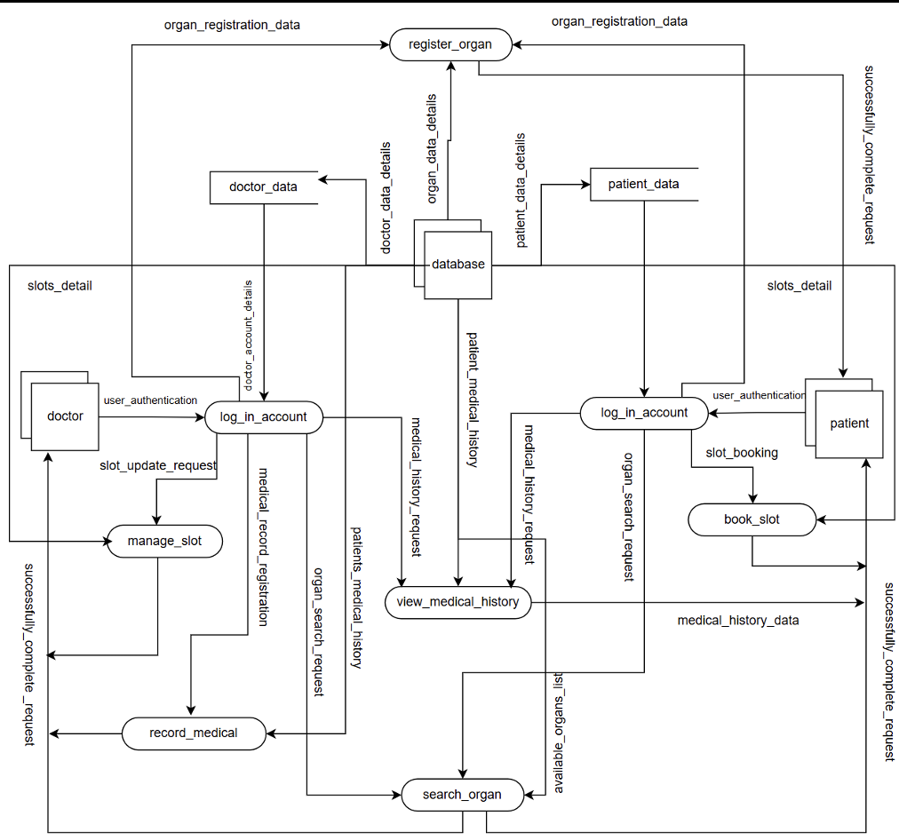

#### Module Diagram
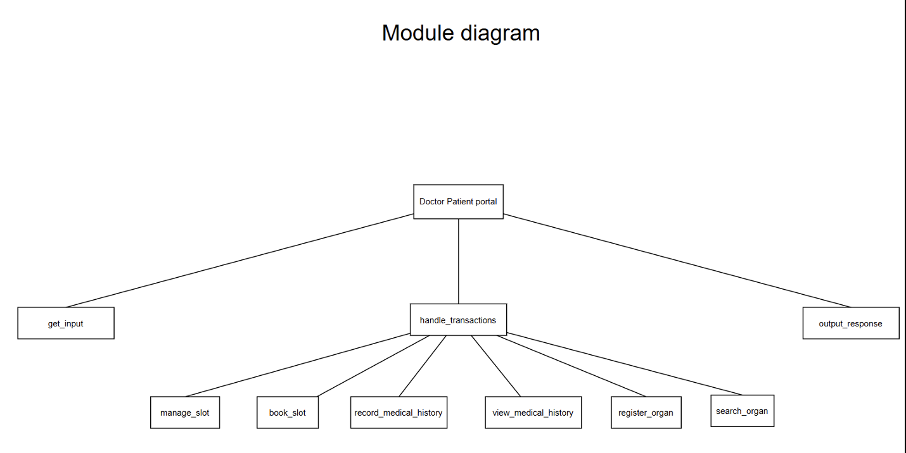

#### MinCase Study
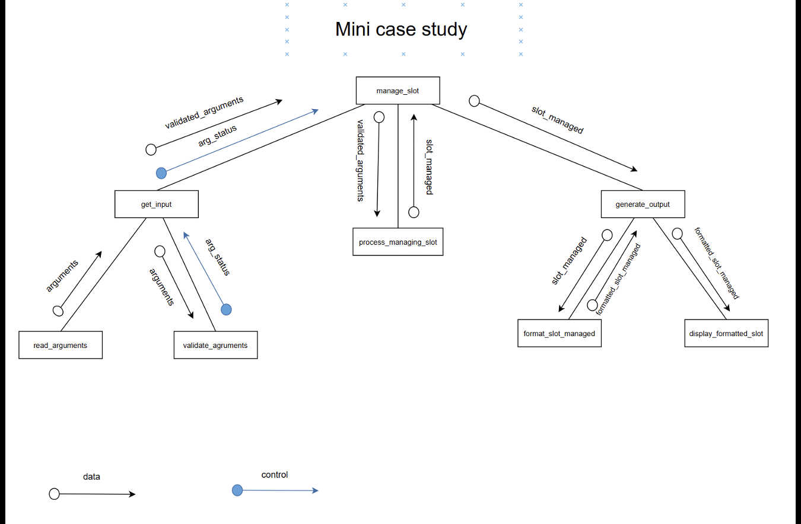

### 📸 Screenshots
### Login Page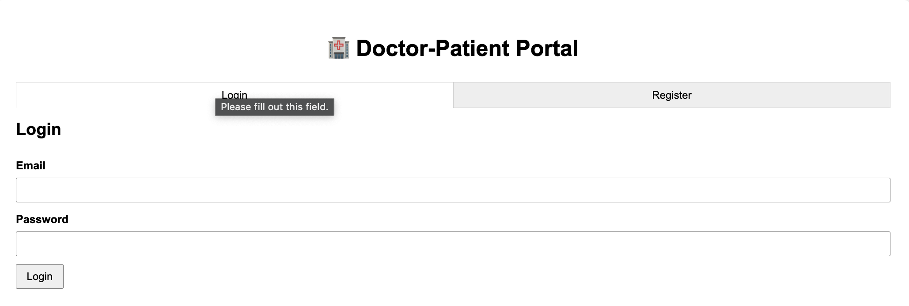

### Register Page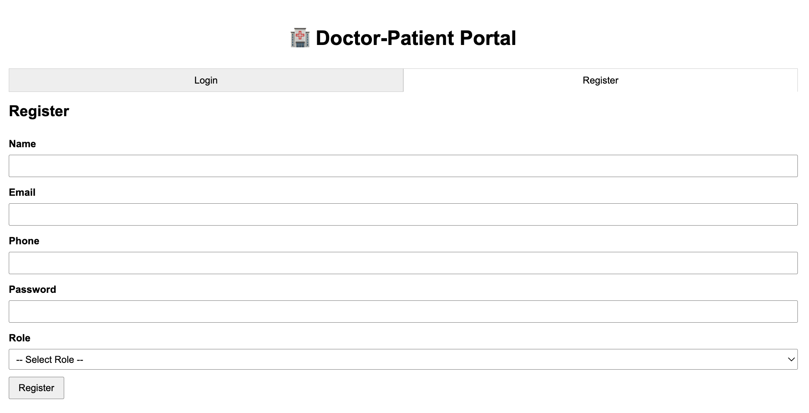

### Patient Dashboard
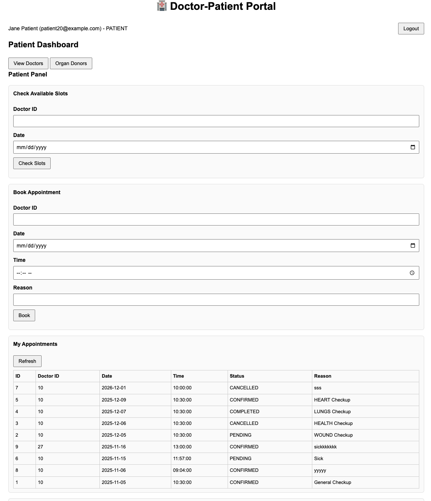
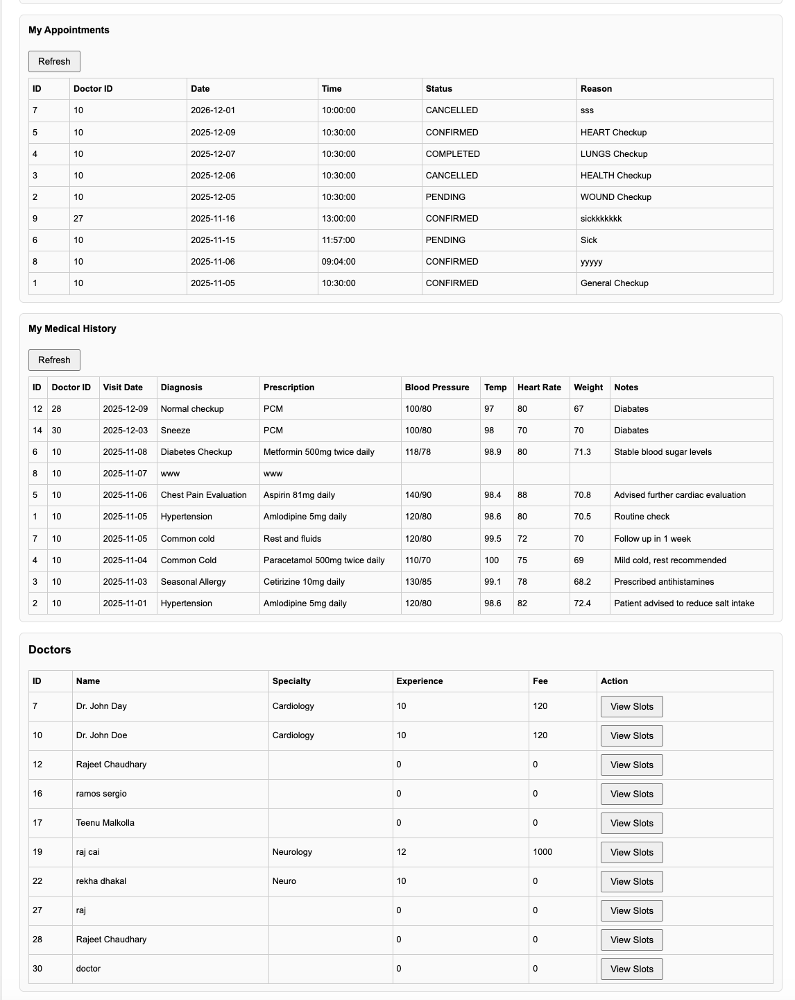

### Doctor Dashboard
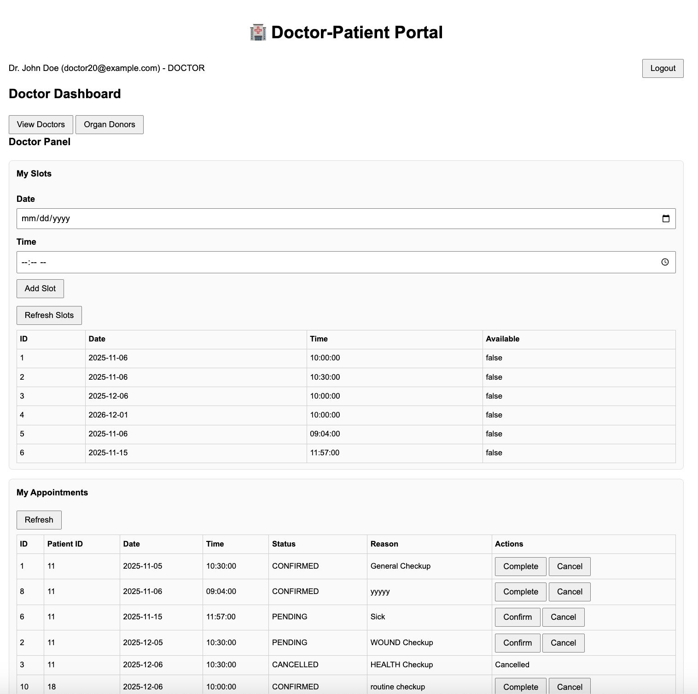
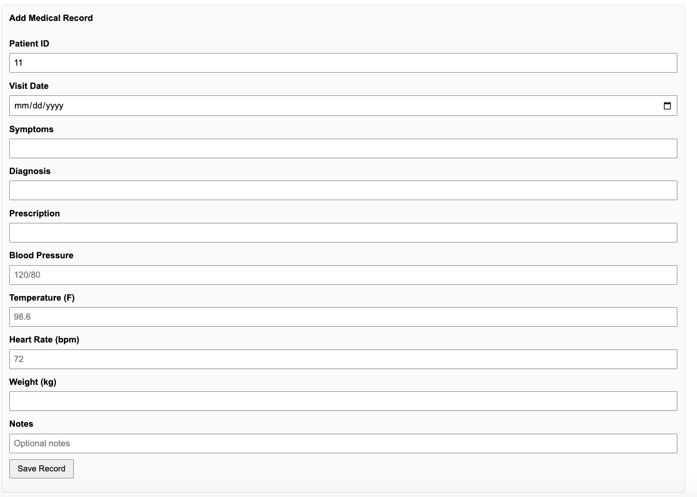

### Organ Donor Registration & Search
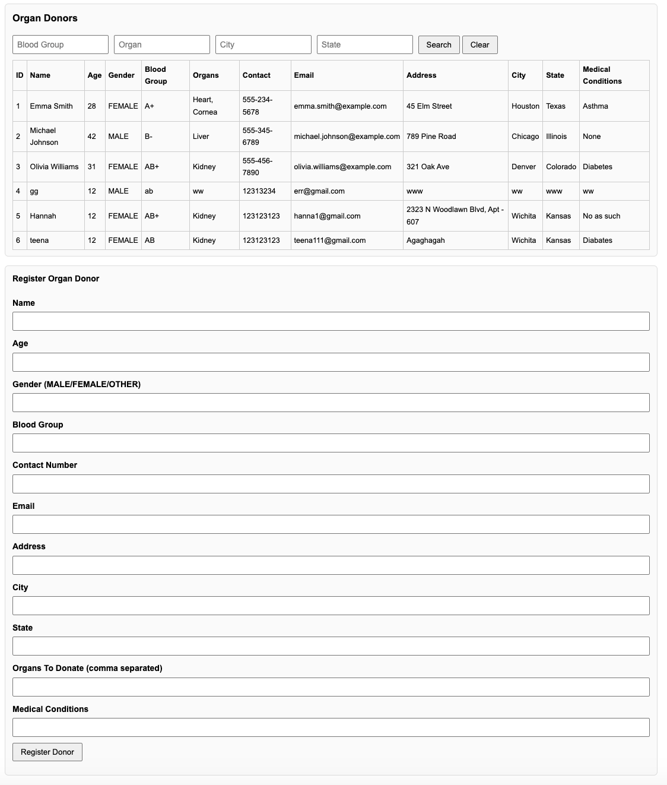


## 🗂️ Project Structure (Recommended Monorepo)
```
doctor-patient-portal/
├── backend/                  
Doctor-Patient-Port-al-Backend
│   ├── src/
│   ├── config/
│   ├── routes/
│   ├── models/
│   ├── controllers/
│   ├── .env
│   └── package.json
├── frontend/
│   ├── public/
│   ├── src/
│   │   ├── components/
│   │   ├── pages/
│   │   ├── context/
│   │   └── App.js
│   ├── .env
│   └── package.json
├── screenshots/
├── .gitignore
└── README.md
```

### 🤝 Contributing & Future Ideas

Contributions welcome!

Suggested improvements
1. Admin dashboard (manage users, stats)
2. Email notifications (appointment confirmations, reminders)
3. File uploads (prescriptions, lab reports)
4. Real-time updates (Socket.io)
5. Search & filters enhancements in organ module
6. PDF export of medical records
7. Docker + docker-compose
8. Unit & integration tests
9. Deploy to Vercel (frontend) + Railway/Render (backend)

## Standard flow:

1. Fork
2. git checkout -b feature/your-feature
3. Commit & push
4. Open Pull Request

## 📜 License
MIT License — see LICENSE file.

Free to use, modify, distribute (even commercially) with original copyright notice.
💬 Contact

⭐ Star the repo if this project helps or inspires you!

Built with care — for learning & demonstration purposes. 🩺